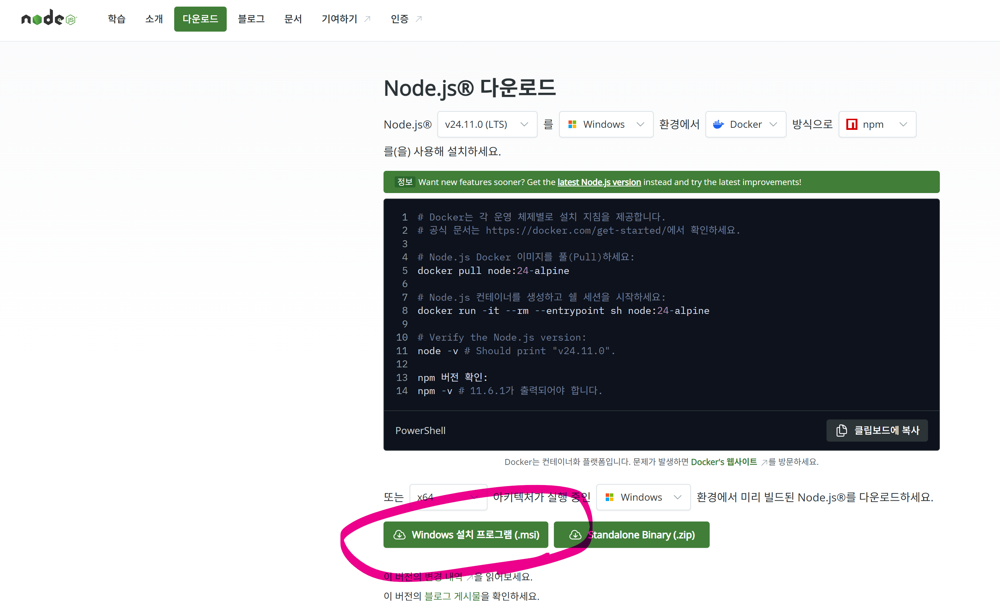
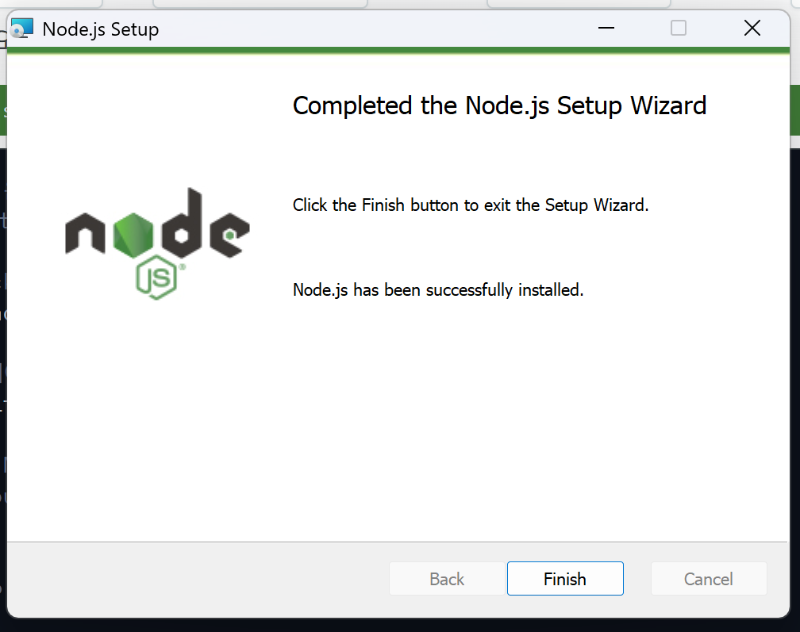

# 실시간 투표 시스템 - 프론트엔드 프로젝트

> **Live Voting**: WebSocket 기반 실시간 투표 플랫폼

실시간으로 투표를 생성하고, 참여하며, 결과를 확인할 수 있는 웹 애플리케이션입니다.

---

## 📋 목차

1. [프로젝트 소개](#-프로젝트-소개)
2. [실행 방법](#-실행-방법)
3. [백엔드 개발자를 위한 API 명세](#-백엔드-개발자를-위한-api-명세)
   - [프로젝트 개요](#-1-프로젝트-개요)
   - [빠른 시작](#-2-빠른-시작)
   - [환경 변수 설정](#-3-환경-변수-설정)
   - [REST API 엔드포인트 명세](#-4-rest-api-엔드포인트-명세)
   - [WebSocket 연결 명세](#-5-websocket-연결-명세)
   - [데이터 스키마 & TypeScript 인터페이스](#-6-데이터-스키마--typescript-인터페이스)
   - [핵심 비즈니스 로직](#-7-핵심-비즈니스-로직)

---

## 📱 프로젝트 소개

### 주요 기능

- **투표 생성**: 제목과 후보자를 입력하여 새로운 투표를 생성
- **실시간 투표 참여**: 진행 중인 투표에 참여하고 언제든지 선택 변경 가능
- **실시간 알림**: WebSocket을 통해 새로운 투표 생성 시 즉시 알림
- **투표 결과 확인**: 득표율을 시각화된 차트로 확인

### 기술 스택

- **프레임워크**: React 19
- **언어**: TypeScript 5.7
- **라우팅**: TanStack Router
- **상태 관리**: Zustand
- **데이터 페칭**: TanStack Query, Ky
- **UI 라이브러리**: HeroUI, Tailwind CSS 4.0
- **실시간 통신**: STOMP over WebSocket, SockJS
- **빌드 도구**: Vite 7
- **테스트**: Vitest, React Testing Library
- **코드 품질**: Biome (Formatter + Linter)

### 화면 구성

#### 1. 투표 목록 페이지


진행 중인 투표와 종료된 투표를 테이블 형태로 확인할 수 있습니다.

#### 2. 투표 생성 페이지


투표 제목과 후보자 목록을 입력하여 새로운 투표를 생성합니다.

#### 3. 투표 참여 페이지


후보자 중 하나를 선택하여 투표하거나 기존 선택을 변경할 수 있습니다.

#### 4. 투표 결과 페이지


득표율과 득표 수를 막대 그래프로 시각화하여 확인합니다.

---

## 🚀 실행 방법

### 필수 요구사항

- **Node.js**: v18 이상 권장
- **npm**: Node.js와 함께 설치됨

### Node.js 설치 가이드

> Node.js는 JavaScript를 브라우저 밖에서도 실행할 수 있게 해주는 **JavaScript 런타임 환경**입니다.
> React 코드를 실행하고 필요한 도구를 설치하기 위해 반드시 필요합니다.

#### 💻 Node.js 홈페이지 접속

Node.js 공식 홈페이지에 접속합니다:

🔗 **[Node.js 공식 사이트](https://nodejs.org/ko)**

---

#### ⬇️ Windows 설치 방법

1. **설치 파일 다운로드**
   
   - Node.js 홈페이지에서 **Windows 설치 프로그램(.msi)** 다운로드
   - LTS(Long Term Support) 버전 권장


2. **설치 마법사 실행**
   
   - 다운로드한 `.exe` 파일 실행
   - 설치 마법사가 시작되면 **Next** 클릭

3. **설치 경로 설정**
   - 기본 경로 사용 권장 (예: `C:\Program Files\nodejs`)

4. **설치 옵션 선택**
   - ✅ **64-bit launcher 생성** 체크
   - ✅ **Add to PATH** 체크 (터미널에서 사용 가능하도록)
   - `.js` 파일 연결 여부는 선택 사항

5. **설치 완료**
   - **Install** 클릭
   - 설치 완료 후 **Finish** 클릭


---

#### ⬇️ macOS 설치 방법

1. **설치 파일 다운로드**
   - Node.js 홈페이지에서 **macOS** 탭 선택
   - 본인의 Mac 칩에 맞는 버전 선택:
     - **Intel 칩**: Intel 버전 다운로드
     - **Apple Silicon (M1/M2/M3 등)**: Apple Silicon 버전 다운로드
   - `.dmg` 파일 다운로드

2. **앱 설치**
   - 다운로드한 `.dmg` 파일 실행
   - IntelliJ 아이콘을 **Applications 폴더**로 드래그 & 드롭
   - 약관에 **agree** 하고 기본 경로로 설치 (경로 변경 비권장)

3. **최초 실행**
   - **Launchpad** 또는 **Finder**에서 Node.js 실행
   - 설정 마이그레이션 여부 선택 (신규 설치 시 "Do not import settings" 선택)

---

#### ✅ 설치 확인

터미널(Windows: CMD 또는 PowerShell, macOS: Terminal)을 **새로** 열고 다음 명령어를 입력합니다:

```bash
node -v
```

정상적으로 설치되었다면 다음과 같이 버전 정보가 출력됩니다(버전은 다를 수도 있습니다):

```
v24.11.0
```

> **참고**: `-v` 플래그는 "version"을 의미합니다.

---

### 설치 및 실행

#### 1. 저장소 클론

```bash
git clone https://github.com/live-commerce-platform/live-voting.git
cd live-voting
```

#### 2. 프론트엔드 디렉토리로 이동

```bash
cd frontend
```

#### 3. 의존성 설치

```bash
npm install
```

#### 4. 환경 변수 설정

`.env.example` 파일을 복사하여 `.env` 파일을 생성합니다:

```bash
cp .env.example .env
```

**옵션 A: Mock API 모드 (백엔드 없이 개발)**

`.env` 파일을 다음과 같이 설정하면 백엔드 서버 없이도 프론트엔드를 실행할 수 있습니다:

```env
VITE_ENABLE_MSW=true
VITE_API_BASE_URL=http://localhost:8080
VITE_WS_URL=http://localhost:8080/ws
```

**옵션 B: 실제 API 모드 (백엔드 서버 연동)**

백엔드 서버가 실행 중인 경우:

```env
VITE_ENABLE_MSW=false
VITE_API_BASE_URL=http://localhost:8080
VITE_WS_URL=http://localhost:8080/ws
```

#### 5. 개발 서버 실행

```bash
npm run dev
```

서버가 성공적으로 실행되면 다음 메시지가 출력됩니다:

```
VITE v7.1.7  ready in 500 ms

➜  Local:   http://localhost:3000/
➜  Network: use --host to expose
```

#### 6. 브라우저에서 접속

브라우저를 열고 [http://localhost:3000](http://localhost:3000)에 접속합니다.

### 사용 가능한 npm 스크립트

| 명령어           | 설명                                  |
| ---------------- | ------------------------------------- |
| `npm run dev`    | 개발 서버 실행 (포트 3000)            |
| `npm run build`  | 프로덕션 빌드 생성 (빌드 + 타입 체크) |
| `npm run serve`  | 프로덕션 빌드 미리보기                |
| `npm run test`   | 테스트 실행                           |
| `npm run lint`   | 코드 린트 검사                        |
| `npm run format` | 코드 포맷팅                           |
| `npm run check`  | 전체 코드 품질 검사 (린트 + 포맷)     |

### Mock API 모드 활용

Mock API 모드(`VITE_ENABLE_MSW=true`)로 실행하면:

- **초기 데이터**: 7명의 멤버, 4개의 투표 (2개 진행 중, 2개 종료)
- **WebSocket 시뮬레이션**: 브라우저 콘솔에서 이벤트 테스트 가능

브라우저 개발자 도구 콘솔에서 WebSocket 이벤트를 수동으로 발행할 수 있습니다:

```javascript
// 투표 생성 이벤트 수동 발행
window.__mockWebSocket.emitVoteCreated({
  id: 'vote-123',
  title: '테스트 투표',
  author: '홍길동',
  authorId: 'user-1',
  createdAt: new Date().toISOString()
})
```

---

## 📚 백엔드 개발자를 위한 API 명세

> 이 섹션은 백엔드 개발자를 위한 종합 가이드입니다.
> 프론트엔드의 모든 API 요구사항, 데이터 스키마, WebSocket 명세를 포함합니다.

---

## 🎯 1. 프로젝트 개요

**프로젝트명**: Live Voting (실시간 투표 시스템)

**주요 기능**:
- 투표 생성 및 관리
- 실시간 투표 참여
- WebSocket을 통한 실시간 알림

**기술 스택**: React 19, TypeScript, TanStack Router, TanStack Query, STOMP WebSocket

---

## 🚀 2. 빠른 시작

### 프론트엔드 실행

```bash
cd frontend
npm install
cp .env.example .env  # 환경 변수 설정
npm run dev           # http://localhost:3000
```

### 환경 변수 설정

프론트엔드는 두 가지 모드로 실행 가능합니다:

**1. Mock API 모드** (백엔드 없이 개발):
```bash
VITE_ENABLE_MSW=true
VITE_API_BASE_URL=http://localhost:8080
VITE_WS_URL=http://localhost:8080/ws
```

**2. 실제 API 모드** (백엔드 서버 연동):
```bash
VITE_ENABLE_MSW=false
VITE_API_BASE_URL=http://localhost:8080
VITE_WS_URL=http://localhost:8080/ws
```

### Mock API (MSW) 정보

- **활성화**: `VITE_ENABLE_MSW=true`로 설정하면 백엔드 없이 프론트엔드만 실행 가능
- **초기 데이터**: 7명의 멤버, 4개의 투표 (2개 진행 중, 2개 종료)
- **WebSocket 시뮬레이션**: 브라우저 콘솔에서 테스트 가능
  ```javascript
  // 투표 생성 이벤트 수동 발행
  window.__mockWebSocket.emitVoteCreated({
    id: 'vote-123',
    title: '테스트 투표',
    author: '홍길동',
    authorId: 'user-1',
    createdAt: new Date().toISOString()
  })
  ```

---

## 🔐 3. 환경 변수 설정

### 📄 파일 위치

- **개발용**: `/frontend/.env`
- **예제**: `/frontend/.env.example`
- **타입 정의**: `/frontend/src/vite-env.d.ts`

### 📌 환경 변수 목록

| 변수명              | 타입      | 기본값                       | 설명                                          |
| ------------------- | --------- | ---------------------------- | --------------------------------------------- |
| `VITE_ENABLE_MSW`   | `string`  | `"false"`                    | MSW Mock API 활성화 여부 (`"true"`/`"false"`) |
| `VITE_API_BASE_URL` | `string?` | `"http://localhost:8080"`    | 백엔드 API 서버 베이스 URL                    |
| `VITE_WS_URL`       | `string`  | `"http://localhost:8080/ws"` | WebSocket 서버 URL                            |

### 🔧 설정 방법

#### 개발 환경 (Mock API 사용)

```bash
# .env
VITE_ENABLE_MSW=true
VITE_API_BASE_URL=http://localhost:8080
VITE_WS_URL=http://localhost:8080/ws
```

#### 프로덕션 환경 (실제 백엔드 서버)

```bash
# .env
VITE_ENABLE_MSW=false
VITE_API_BASE_URL=https://api.yourdomain.com
VITE_WS_URL=wss://api.yourdomain.com/ws
```

---

## 🌐 4. REST API 엔드포인트 명세

### 🔧 HTTP 클라이언트 정보

- **베이스 URL**: `VITE_API_BASE_URL` (기본값: `http://localhost:8080`)
- **타임아웃**: 10초
- **재시도**: GET, PUT, DELETE만 최대 2회 (POST는 중복 방지를 위해 재시도 안 함)

---

### 📡 REST API 엔드포인트

#### **1️⃣ 멤버 관리 API**

##### **GET /api/members** - 멤버 목록 조회

**설명**: 시스템에 등록된 모든 멤버(사용자) 목록을 조회합니다.

**Request**: 없음

**Response**: `Member[]`

```typescript
interface Member {
  id: string
  name: string
}
```

**Response 예시**:
```json
[
  { "id": "1", "name": "김철수" },
  { "id": "2", "name": "이영희" },
  { "id": "3", "name": "박지훈" }
]
```

**Status Code**: `200 OK`

---

#### **2️⃣ 투표 관리 API**

##### **GET /api/votes** - 투표 목록 조회

**설명**: 생성된 모든 투표 목록을 조회합니다.

**Request**: 없음

**Response**: `Vote[]` (타입 정의는 [섹션 6](#-6-데이터-스키마--typescript-인터페이스) 참조)

**Response 예시**:
```json
[
  {
    "id": "1",
    "title": "점심 메뉴 선택",
    "status": "OPEN",
    "author": "김철수",
    "authorId": "1",
    "createdAt": "2025-01-15T09:00:00Z",
    "candidates": [
      { "id": "1", "name": "한식", "voteCount": 5 },
      { "id": "2", "name": "중식", "voteCount": 3 },
      { "id": "3", "name": "일식", "voteCount": 2 },
      { "id": "4", "name": "양식", "voteCount": 1 }
    ],
    "totalVotes": 11
  },
  {
    "id": "2",
    "title": "회의 시간 투표",
    "status": "CLOSED",
    "author": "이영희",
    "authorId": "2",
    "createdAt": "2025-01-10T14:00:00Z",
    "closedAt": "2025-01-15T16:00:00Z",
    "candidates": [
      { "id": "1", "name": "오전 10시", "voteCount": 8 },
      { "id": "2", "name": "오후 2시", "voteCount": 12 },
      { "id": "3", "name": "오후 4시", "voteCount": 5 }
    ],
    "totalVotes": 25
  }
]
```

**Status Code**: `200 OK`

---

##### **GET /api/votes/:id** - 투표 상세 조회

**설명**: 특정 투표의 상세 정보를 조회합니다.

**Path Parameters**:
- `id` (string, 필수): 투표 ID

**Request**: 없음

**Response**: `VoteDetail` (타입 정의는 [섹션 6](#-6-데이터-스키마--typescript-인터페이스) 참조)

**Response 예시**:
```json
{
  "id": "1",
  "title": "점심 메뉴 선택",
  "status": "OPEN",
  "author": "김철수",
  "authorId": "1",
  "createdAt": "2025-01-15T09:00:00Z",
  "candidates": [
    { "id": "1", "name": "한식", "voteCount": 5 },
    { "id": "2", "name": "중식", "voteCount": 3 },
    { "id": "3", "name": "일식", "voteCount": 2 },
    { "id": "4", "name": "양식", "voteCount": 1 }
  ],
  "totalVotes": 11
}
```

**Status Code**:
- `200 OK`: 성공
- `404 Not Found`: 투표를 찾을 수 없음

**Error Response 예시**:
```json
{
  "error": "Vote not found",
  "message": "투표를 찾을 수 없습니다."
}
```

---

##### **POST /api/votes** - 투표 생성

**설명**: 새로운 투표를 생성합니다.

**Request**: `CreateVoteRequest` (타입 정의는 [섹션 6](#-6-데이터-스키마--typescript-인터페이스) 참조)

**Request Body 예시**:
```json
{
  "title": "점심 메뉴 선택",
  "candidates": ["한식", "중식", "일식", "양식"],
  "authorId": "1"
}
```

**Response**: `Vote`

**Response 예시**:
```json
{
  "id": "5",
  "title": "점심 메뉴 선택",
  "status": "OPEN",
  "author": "김철수",
  "authorId": "1",
  "createdAt": "2025-01-20T10:00:00Z",
  "candidates": [
    { "id": "1", "name": "한식", "voteCount": 0 },
    { "id": "2", "name": "중식", "voteCount": 0 },
    { "id": "3", "name": "일식", "voteCount": 0 },
    { "id": "4", "name": "양식", "voteCount": 0 }
  ],
  "totalVotes": 0
}
```

**Status Code**: `201 Created`

**비즈니스 로직**:
1. 투표 생성 및 DB 저장
2. 초기 상태: `status = "OPEN"`, `totalVotes = 0`
3. 각 후보자의 `voteCount = 0`으로 초기화
4. **중요**: 투표 생성 후 **500ms 후**에 WebSocket으로 `/topic/vote-created` 이벤트 발행 (자세한 내용은 [WebSocket 명세](#-4-websocket-연결-명세) 참조)

**Validation**:
- `title`: 필수, 빈 문자열 불가
- `candidates`: 필수, 최소 2개 이상
- `authorId`: 필수, 유효한 멤버 ID

---

##### **PATCH /api/votes/:id/close** - 투표 종료

**설명**: 진행 중인 투표를 종료합니다.

**Path Parameters**:
- `id` (string, 필수): 투표 ID

**Request**: 없음

**Response**: `Vote`

**Response 예시**:
```json
{
  "id": "1",
  "title": "점심 메뉴 선택",
  "status": "CLOSED",
  "author": "김철수",
  "authorId": "1",
  "createdAt": "2025-01-15T09:00:00Z",
  "closedAt": "2025-01-20T12:00:00Z",
  "candidates": [
    { "id": "1", "name": "한식", "voteCount": 5 },
    { "id": "2", "name": "중식", "voteCount": 3 },
    { "id": "3", "name": "일식", "voteCount": 2 },
    { "id": "4", "name": "양식", "voteCount": 1 }
  ],
  "totalVotes": 11
}
```

**Status Code**:
- `200 OK`: 성공
- `404 Not Found`: 투표를 찾을 수 없음

**비즈니스 로직**:
1. `status`를 `"CLOSED"`로 변경
2. `closedAt`을 현재 시간으로 설정 (ISO 8601 형식)
3. 종료 후에는 더 이상 투표 제출 불가

---

##### **POST /api/votes/:id/submit** - 투표 제출

**설명**: 특정 후보자에게 투표하거나 기존 투표를 변경합니다.

**Path Parameters**:
- `id` (string, 필수): 투표 ID

**Request**: `SubmitVoteRequest` (타입 정의는 [섹션 6](#-6-데이터-스키마--typescript-인터페이스) 참조)

**Request Body 예시**:
```json
{
  "voteId": "1",
  "candidateId": "2",
  "voterId": "user-123"
}
```

**Response**: `VoteRecord` (타입 정의는 [섹션 6](#-6-데이터-스키마--typescript-인터페이스) 참조)

**Response 예시 (신규 투표)**:
```json
{
  "voteId": "1",
  "candidateId": "2",
  "voterId": "user-123",
  "votedAt": "2025-01-20T10:30:00Z"
}
```

**Response 예시 (투표 변경)**:
```json
{
  "voteId": "1",
  "candidateId": "3",
  "voterId": "user-123",
  "votedAt": "2025-01-20T10:30:00Z",
  "updatedAt": "2025-01-20T11:00:00Z"
}
```

**Status Code**:
- `201 Created`: 성공
- `404 Not Found`: 투표를 찾을 수 없음
- `400 Bad Request`: 종료된 투표에 제출 시도

**Error Response 예시 (종료된 투표)**:
```json
{
  "error": "Vote is closed",
  "message": "종료된 투표입니다."
}
```

**비즈니스 로직** (매우 중요!):

1. **신규 투표 (해당 투표에 처음 참여)**:
   - `totalVotes` += 1
   - 선택한 `candidateId`의 `voteCount` += 1
   - `VoteRecord` 생성 (`votedAt` 기록)

2. **투표 변경 (이미 투표한 사용자가 다른 후보로 변경)**:
   - 이전 `candidateId`의 `voteCount` -= 1
   - 새 `candidateId`의 `voteCount` += 1
   - `totalVotes` **유지** (변경 없음)
   - `VoteRecord` 업데이트 (`updatedAt` 기록)

3. **중복 투표 방지**:
   - `voterId` 기준으로 동일 `voteId`에 한 번만 투표 가능
   - 투표 변경은 허용

4. **종료된 투표 처리**:
   - `status === "CLOSED"`인 경우 `400 Bad Request` 반환

---

##### **GET /api/votes/:id/vote-record** - 투표 기록 조회

**설명**: 특정 투표에 대한 투표자의 투표 기록을 조회합니다.

**Path Parameters**:
- `id` (string, 필수): 투표 ID

**Query Parameters**:
- `voterId` (string, 필수): 투표자 ID

**Request**: 없음

**Request URL 예시**:
```
GET /api/votes/1/vote-record?voterId=user-123
```

**Response**: `VoteRecord | null`

**Response 예시 (투표 기록 있음)**:
```json
{
  "voteId": "1",
  "candidateId": "2",
  "voterId": "user-123",
  "votedAt": "2025-01-20T10:30:00Z"
}
```

**Response 예시 (투표 기록 없음)**:
```json
null
```

**Status Code**:
- `200 OK`: 성공 (기록이 없어도 `200` 반환, body는 `null`)
- `400 Bad Request`: `voterId` 파라미터 누락

**Error Response 예시**:
```json
{
  "error": "Missing parameter",
  "message": "voterId 파라미터가 필요합니다."
}
```

**사용 목적**:
- 투표 참여 페이지에서 사용자가 이미 투표했는지 확인
- 이미 투표한 경우 현재 선택한 후보자를 표시

---

## 🔌 5. WebSocket 연결 명세

### 📡 WebSocket 프로토콜

**프로토콜**: STOMP over SockJS
**라이브러리**: `@stomp/stompjs` + `sockjs-client`
**연결 URL**: `import.meta.env.VITE_WS_URL` (기본값: `http://localhost:8080/ws`)

### 🔄 연결 설정

프론트엔드는 다음과 같이 STOMP 클라이언트를 설정합니다:

```typescript
import { Client } from '@stomp/stompjs'
import SockJS from 'sockjs-client'

const client = new Client({
  webSocketFactory: () => new SockJS(VITE_WS_URL),
  reconnectDelay: 5000,      // 자동 재연결 5초 대기
  heartbeatIncoming: 4000,   // 서버 heartbeat 수신 간격 (4초)
  heartbeatOutgoing: 4000,   // 클라이언트 heartbeat 송신 간격 (4초)
  debug: (str) => {
    console.log('[STOMP]', str)
  },
})

client.onConnect = () => {
  console.log('WebSocket connected')

  // 토픽 구독
  client.subscribe('/topic/vote-created', (message) => {
    const event = JSON.parse(message.body)
    // 이벤트 처리
  })
}

client.activate()
```

### 📬 구독 토픽

#### **토픽: `/topic/vote-created`**

**설명**: 새로운 투표가 생성되었을 때 모든 연결된 클라이언트에게 브로드캐스트합니다.

**메시지 타입**: `VoteCreatedEvent`

```typescript
interface VoteCreatedEvent {
  id: string           // 생성된 투표 ID
  title: string        // 투표 제목
  author: string       // 작성자 이름
  authorId: string     // 작성자 ID
  createdAt: string    // ISO 8601 형식
}
```

**메시지 예시**:
```json
{
  "id": "5",
  "title": "점심 메뉴 선택",
  "author": "김철수",
  "authorId": "1",
  "createdAt": "2025-01-20T10:00:00Z"
}
```

**백엔드 구현 시 주의사항**:
- SockJS 엔드포인트: `/ws`
- STOMP 브로커 Prefix: `/topic`
- **중요**: 투표 생성 후 **500ms 후**에 `/topic/vote-created` 이벤트 발행 (프론트엔드 페이지 전환 시간 확보)

---

## 📦 6. 데이터 스키마 & TypeScript 인터페이스

### 🗂️ 타입 정의 위치

- **멤버 타입**: `/frontend/src/features/auth/types/member.types.ts`
- **투표 타입**: `/frontend/src/features/votes/types/vote.types.ts`

### 📋 전체 타입 정의

```typescript
// ==================== 멤버 타입 ====================
export interface Member {
  id: string
  name: string
}

// ==================== 투표 타입 ====================
export type VoteStatus = 'OPEN' | 'CLOSED'

export interface Vote {
  id: string
  title: string
  status: VoteStatus
  author: string            // 작성자 이름
  authorId: string          // 작성자 ID
  createdAt: string         // ISO 8601 (예: "2025-01-20T10:00:00Z")
  closedAt?: string         // ISO 8601 (CLOSED 상태일 때만)
  candidates?: VoteCandidate[]
  totalVotes?: number
}

export interface VoteCandidate {
  id: string
  name: string
  voteCount: number
}

export interface VoteDetail extends Vote {
  candidates: VoteCandidate[]  // 상세 조회 시 필수
  totalVotes: number           // 상세 조회 시 필수
}

// ==================== 요청 타입 ====================
export interface CreateVoteRequest {
  title: string
  candidates: string[]  // 후보자 이름 배열
  authorId: string
}

export interface CloseVoteRequest {
  id: string
}

export interface SubmitVoteRequest {
  voteId: string
  candidateId: string
  voterId: string
}

// ==================== 투표 기록 ====================
export interface VoteRecord {
  voteId: string
  candidateId: string
  voterId: string
  votedAt: string       // ISO 8601
  updatedAt?: string    // ISO 8601 (투표 변경 시)
}

// ==================== WebSocket 이벤트 ====================
export interface VoteCreatedEvent {
  id: string
  title: string
  author: string
  authorId: string
  createdAt: string  // ISO 8601
}
```

### 📝 JSON Schema 예시 (참고용)

백엔드에서 Validation을 위해 JSON Schema를 사용하는 경우:

```json
{
  "CreateVoteRequest": {
    "type": "object",
    "required": ["title", "candidates", "authorId"],
    "properties": {
      "title": {
        "type": "string",
        "minLength": 1
      },
      "candidates": {
        "type": "array",
        "items": { "type": "string" },
        "minItems": 2
      },
      "authorId": {
        "type": "string",
        "minLength": 1
      }
    }
  }
}
```

---

## 🎯 7. 핵심 비즈니스 로직

### 🔒 중복 투표 방지

- `VoteRecord` 테이블에 `(voteId, voterId)` 복합 Unique 제약 조건 설정
- 동일한 `voterId`는 동일한 `voteId`에 한 번만 투표 가능
- 투표 변경은 허용 (기존 레코드 업데이트)

### 📊 데이터베이스 스키마 예시

```sql
-- 멤버 테이블
CREATE TABLE members (
  id VARCHAR(255) PRIMARY KEY,
  name VARCHAR(255) NOT NULL
);

-- 투표 테이블
CREATE TABLE votes (
  id VARCHAR(255) PRIMARY KEY,
  title VARCHAR(255) NOT NULL,
  status VARCHAR(10) NOT NULL CHECK (status IN ('OPEN', 'CLOSED')),
  author VARCHAR(255) NOT NULL,
  author_id VARCHAR(255) NOT NULL,
  created_at TIMESTAMP NOT NULL,
  closed_at TIMESTAMP,
  total_votes INT DEFAULT 0,
  FOREIGN KEY (author_id) REFERENCES members(id)
);

-- 후보자 테이블
CREATE TABLE vote_candidates (
  id VARCHAR(255) PRIMARY KEY,
  vote_id VARCHAR(255) NOT NULL,
  name VARCHAR(255) NOT NULL,
  vote_count INT DEFAULT 0,
  FOREIGN KEY (vote_id) REFERENCES votes(id) ON DELETE CASCADE
);

-- 투표 기록 테이블
CREATE TABLE vote_records (
  vote_id VARCHAR(255) NOT NULL,
  candidate_id VARCHAR(255) NOT NULL,
  voter_id VARCHAR(255) NOT NULL,
  voted_at TIMESTAMP NOT NULL,
  updated_at TIMESTAMP,
  PRIMARY KEY (vote_id, voter_id),
  FOREIGN KEY (vote_id) REFERENCES votes(id) ON DELETE CASCADE,
  FOREIGN KEY (candidate_id) REFERENCES vote_candidates(id) ON DELETE CASCADE
);
```

